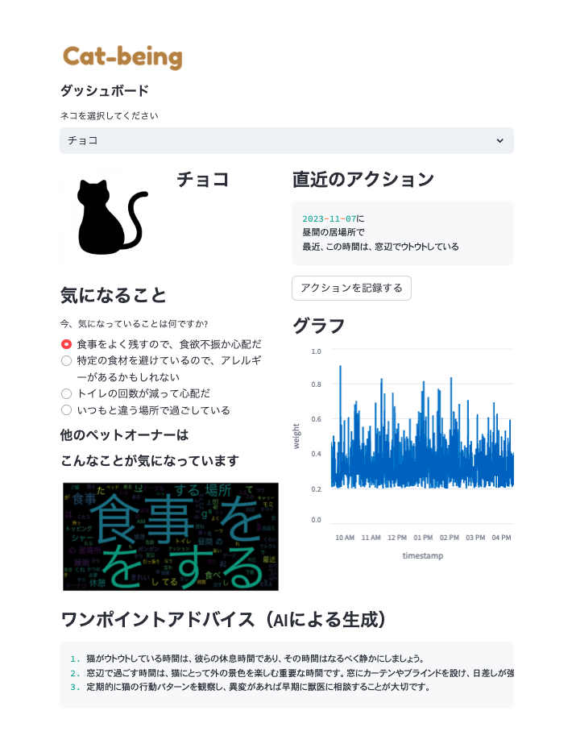

# wbh2023-prototype

## Cat-being Dashboard



## Quick Start

### Dependency

```
streamlit==1.28.1
pillow==6.2.0
openai==1.2.3
gsheetsdb==0.1.13.1
wordcloud==1.9.2
janome==0.5.0
pandas==1.5.3
matplotlib==3.5.3
```

主要なライブラリのみ記載しています。
その他は、実行環境ごとに調整してください。

### Installation

```
pip install -r requirements.txt
```

### Run

```
streamlit run app.py
```
